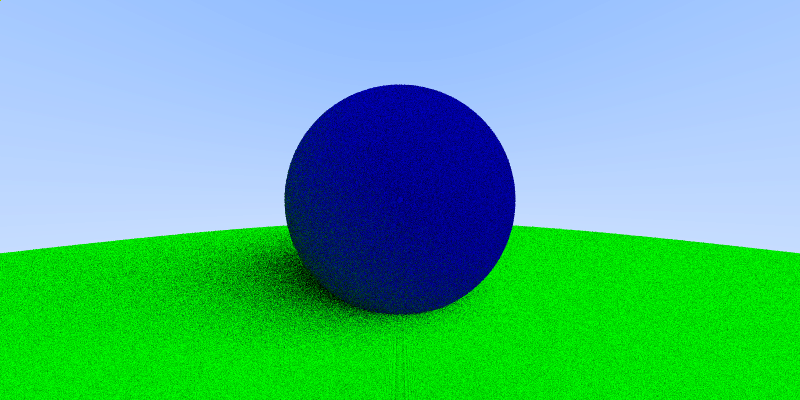

# Big Neko Learns Ray Tracing

This is a tutorial project created by a big cat (me) in order to learn ray tracing.

## **Chapter 0.** How to create a figure.

This library is in RenderLib, with function to create a binary .ppm(P6) format. Following is an example of library generated by RenderLib. This is a circle in the square, with 256x256 pixel. This lib will be the basis of following ray tracing code.

## **Chapter 1.** How to render a sphere.

First we need to build a background imag, the background is gradually changing from blue to white, which looks like follows (the image is *400 pixels* height x *800 pixels* width).

Now that we have the background image, we can draw a sphere on the basis of it. The equation to describe a sphere looks like follows. 

$$ (\mathbf{r} - \mathbf{r_c})^2 = r^2 $$

where $ \mathbf{r_c} = (x_c, y_c, z_c) $ being the coordinate of sphere cneter, and $r$ being the radius of sphere. A ray is a straight line, so it shall have the equestion of 

$$ \mathbf{r }= \mathbf{r_0} + \mathbf{v} \cdot t$$

where $r = (x, y, z)$, $r_0$ is the starting point of the ray, $\mathbf{v}$ is the direction of the ray and $t$ a parameter describing the running of points on the straight line. With the two equations, it can be easily found that $t$ should satisfy (by constraining $v^2=1$):

$$(\mathbf{r_0}-\mathbf{r_c})^2 +2(\mathbf{r_0}-\mathbf{r_c})\cdot \mathbf{v} \cdot t + t^2 = r^2$$

We can simply judge if the ray has hit the surface by the following variable:

$$ \Delta = 4[(\mathbf{r_0}-\mathbf{r_c})\cdot\mathbf{v}]^2 - 4*[(\mathbf{r_0}-\mathbf{r_c})^2 - r^2]$$

We have hit, tangent to and away from sphere 3 situations, correponding to $ \Delta >0, \Delta =0, \Delta <0$ three cases. After knowing the hit situation of each ray, it is easy to draw a sphere as follows.

## **Chapter 2.** Add a normal vector to the sphere

From the above chapter, we can have the intersection point between the sphere and the ray, therefore it is easy to computer the normal vector of hit point. By calculating the normal vector and give colors to pixels according to the normal vector of the sphere surface, we can render the surface as follows.

Of course, we need a library that can handle multiple objects, so we design an abstract parent class geometry, which has two method, **intercept** and **color**, the first one return the parameter *t* where the ray intercepts with the geometry object, the second decide the surface color of object which hit a ray. This can be seen as follows. Here we place another green sphere as the background. So we can see a "green background". 

## **Chapter 3.** Anti-aliasing
We can see some aliasing in the above spheres, in oder eliminate this aliasing effects, we need to sample several rays for one pixel. This can be done by randomly add some real numbers between 0 and 1, and average the output of the rays. The more random number we sampled, the better anti-aliasing effect is. Owing to the large number sampling will slow down the rendering speed, here we only use a sampling number equals to 10. Following is the effect. We  can observ improvement of rendering qualiies (especially the boundary of spheres).

## **Chapter 4.** Diffuse material
Starting from this chapter, we are going to consider the material of sphere. The material of sphere will decide the appearance of a whole material. A simple class of material is called diffuse material. That means, if a light is shade on to the material, it will randomly bounces into any directions. Here we will use a uniform distribution to simulate this behavior. By simulating the ray bouncing many times, we can get the image as follows. We can find the ball is something like plastic, and we can find some shadow near the sphere.

## **Chapter 5.** Metal material
Then we can start with metal material. Then metal material is different from the diffuse material that it can reflect the light with some specified directions. We would like to specify a reflectivity and diffusity for this material. In the following graph, we can find two metal spheres reflecting to each other.

We can also add some diffusive effects on the metals, in the following graphs, the sphere in the left the the one with diffusity equals to 0.5, and the right one is the one with diffusity equals to 0.0 (mirror reflection). Notice here we have add an anti-aliasing x100, and it seems to be clearer than the usually x10 we use.

## **Chapter 6.** Dielectrics

